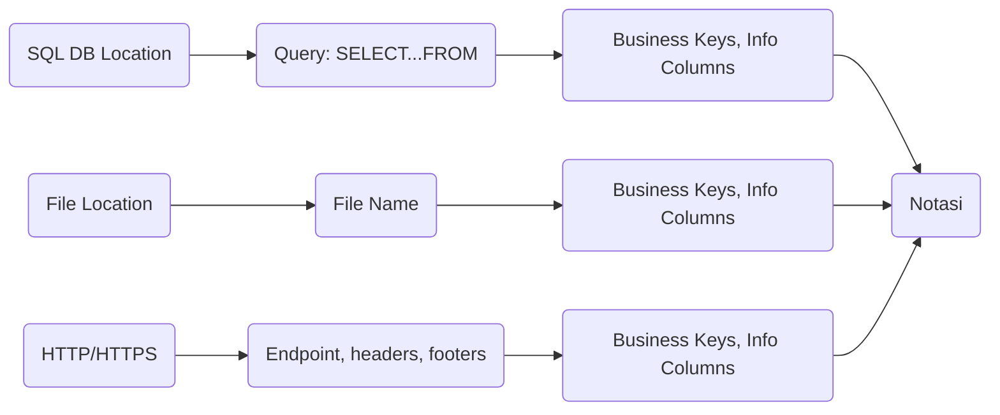

# Welcome to Notasi!

Notasi is designed for 2 different types of people:

 - People who want to care about data, but don't know what data they've got
 - People who don't want to care about data, but have to

# Design Principles

<h3> Ease of use over performance </h3>
Instead of stressing about perfectly structuring their data, they tell Notasi how a piece of information is identified (business keys) and what changes to the information they care about (e.g. email address but not last read time). Notasi handles the rest.  
        
<h3> Designed to be outgrown </h3>
Notasi has been built to have the lowest possible barrier of entry. While scaling Notasi should be possible, it’s designed to help users solve their problems until they’re ready for other enterprise solutions.  
        
<h3>Only basic SQL skills needed </h3>
if you understand:

```SQL
SELECT 
	column 
FROM 
	tab1 
	inner join tab2 on tab1.x = tab2.y
```

then you can implement and use Notasi

## Installation
*Tested on a fresh Ubuntu 18.04 EC2 instance*

Run:
```bash
wget https://raw.githubusercontent.com/tullyclark/notasi/master/install/install.sh
chmod +x install.sh
sudo ./install.sh
```

You will then be stepped through the setup process 
## Data Flow

You can render UML diagrams using [Mermaid](https://mermaidjs.github.io/). For example, this will produce a sequence diagram:



Blah
```mermaid
graph LR
```
